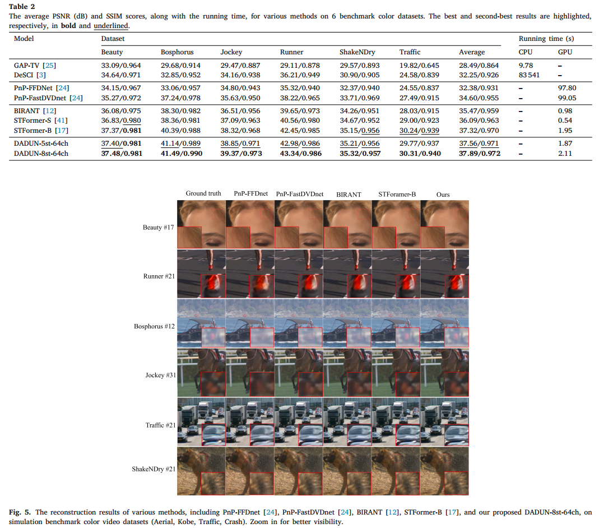

# DADUN for video SCI
This repo is the implementation of "[Degradation-aware Deep Unfolding Network with Transformer Prior for Video Compressive Imaging](https://doi.org/10.1016/j.sigpro.2024.109660)". 
## Abstract
In video snapshot compressive imaging (SCI) systems, video reconstruction methods are used to recover spatial?temporal-correlated video frame signals from a compressed measurement. While unfolding methods have demonstrated promising performance, they encounter two challenges: (1) They lack the ability to estimate degradation patterns and the degree of ill-posedness from video SCI, which hampers guiding and supervising the iterative learning process. (2) The prevailing reliance on 3D-CNNs in these methods limits their capacity to capture long-range dependencies. To address these concerns, this paper introduces the Degradation-Aware Deep Unfolding Network (DADUN). DADUN leverages estimated priors from compressed frames and the physical mask to guide and control each iteration. We also develop a novel Bidirectional Propagation Convolutional Recurrent Neural Network (BiP-CRNN) that simultaneously captures both intra-frame contents and inter-frame dependencies. By plugging BiP-CRNN into DADUN, we establish a novel end-to-end (E2E) and data-dependent deep unfolding method, DADUN with transformer prior (TP), for video sequence reconstruction. Experimental results on various video sequences show the effectiveness of our proposed approach, which is also robust to random masks and has wide generalization bound. 
## Testing Result on Simulation Dataset
<div align="center">
      
  Fig1. Reconstructed Color Data via Different Algorithms
  
  More Testing Results [BaiduNetdisk](https://pan.baidu.com/s/1iwjYCJ_7jwggoWERXgU5GA?pwd=i768)
</div>

## Installation
Please see the [Installation Manual](docs/install.md) for DADUN Installation. 


## Training 
Support multi GPUs and single GPU training efficiently. First download DAVIS 2017 dataset from [DAVIS website](https://davischallenge.org/), then modify *data_root* value in *configs/\_base_/davis.py* file, make sure *data_root* link to your training dataset path.

Launch multi GPU training by the statement below:

```
CUDA_VISIBLE_DEVICES=0,1,2,3 python -m torch.distributed.launch --nproc_per_node=4  --master_port=3278 tools/train.py configs/DUN_RNNViT/dun_rnnvit.py --distributed=True
```

Launch single GPU training by the statement below.

Default using GPU 0. One can also choosing GPUs by specify CUDA_VISIBLE_DEVICES

```
python tools/train.py configs/DUN_RNNViT/dun_rnnvit.py
```

## Testing DADUN on Grayscale Simulation Dataset 
Specify the path of weight parameters, then launch 6 benchmark test in grayscale simulation dataset by executing the statement below.

```
python tools/test.py configs/DUN_RNNViT/dun_rnnvit.py --weights=checkpoints/dadun_5i64ch_gray.pth
```

## Testing DADUN in Color Simulation Dataset 
First, download the model weight file (checkpoints/checkpoints/dadun_5i64ch_mid_color.pth) and test data (datasets/middle_scale) from [BaiduNetdisk](https://pan.baidu.com/s/1D6qC-T8MwuLCnfrrZWlSuQ?pwd=xurh), and place them in the checkpoints folder and test_datasets folder respectively. 
Then, execute the statement below to launch DADUN in 6 middle color simulation dataset. 
```
python tools/test.py configs/DUN_RNNViT/dun_rnnvit_color.py --weights=checkpoints/dadun_5i64ch_mid_color.pth
```

## Testing DADUN on Real Dataset 
Download model weight file (checkpoints/dadun_5i64ch_real_cr10.pth) from [BaiduNetdisk](https://pan.baidu.com/s/1D6qC-T8MwuLCnfrrZWlSuQ?pwd=xurh). 
Launch DADUN on real dataset by executing the statement below.

```
python tools/test_real_data.py configs/DUN_RNNViT/dun_rnnvit_real_cr10.py --weights=checkpoints/dadun_5i64ch_real_cr10.pth

```
Notice:

Results only show real data when its compress ratio (cr) equals to 10, for other compress ratio, we only need to change the *cr* value in file in *dun_rnnvit_real_cr10.py* and retrain the model.

## Citation
```
@article{yin2025degradation,
  title={Degradation-aware deep unfolding network with transformer prior for video compressive imaging},
  author={Yin, Jianfu and Wang, Nan and Hu, Binliang and Wang, Yao and Wang, Quan},
  journal={Signal Processing},
  volume={227},
  pages={109660},
  year={2025},
  publisher={Elsevier}
}
```
## Acknowledgement
The codes are based on [CACTI](https://github.com/ucaswangls/cacti), 
we also refer to codes in [Pyramid Vision Transformer](https://github.com/whai362/PVT.git), 
[STFormer](https://github.com/ucaswangls/STFormer.git), 
Thanks for their awesome works.
